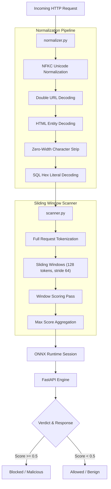

# ML-Based Web Application Firewall (WAF)

[](LICENSE)
[](https://www.python.org/)
[](https://fastapi.tiangolo.com/)
[](https://onnxruntime.ai/)
[](https://www.docker.com/)
[](https://huggingface.co/Shade63/waf-onnx)

A high-performance, machine learning-driven Web Application Firewall (WAF) designed to inspect, score, and detect malicious HTTP requests in real-time. Powered by a fine-tuned **DistilBERT** transformer model served via **ONNX Runtime** for ultra-low latency inline request classification (~21ms).

Built as a semester research & development project comparing transformer-based neural detection against traditional signature-based WAFs (such as ModSecurity).

---

## 📋 Table of Contents

- [Overview](#overview)
- [Architecture](#architecture)
- [Two Original Contributions](#two-original-contributions)
  - [1. Multi-Layer Normalization](#1-multi-layer-input-normalization-proxynormalizerpy)
  - [2. Sliding-Window Scanner](#2-sliding-window-inference-proxyscannerpy)
- [Model Performance & Benchmarks](#model-performance--benchmarks)
  - [Evaluation Summary](#evaluation-summary)
  - [Known Limitations & Threshold Analysis](#known-limitations--threshold-analysis)
- [Tech Stack](#tech-stack)
- [Project Structure](#project-structure)
- [Quick Start](#quick-start)
  - [Local Development](#local-development)
  - [Docker Container](#docker-container)
  - [Health Check Verification](#health-check-verification)
- [API Reference](#api-reference)
  - [POST /score](#post-score)
  - [POST /batch_score](#post-batch_score)
  - [GET /health](#get-health)
- [Live Interactive Dashboard](#live-interactive-dashboard)
- [Testing & Evaluation](#testing--evaluation)
- [Data Sources & Attribution](#data-sources--attribution)
- [License](#license)

---

## 🎯 Overview

Traditional Web Application Firewalls (WAFs) rely heavily on regular expression matching against known attack signatures. While extremely fast, signature-based WAFs are notoriously brittle — attackers can easily bypass signatures using encoding tricks, character substitution, zero-width characters, or padding payload strings.

This project investigates whether fine-tuning a transformer-based language model (DistilBERT) allows a WAF to generalize effectively across complex, obfuscated web payloads while maintaining low enough inference latency to run in-line.

The system consumes raw HTTP requests (HTTP method, path, query parameters, request body, headers, cookies), normalizes the content across multiple layers to undo evasion encodings, executes a sliding-window tokenized scan, and delivers a definitive classification (`malicious` vs `benign`) alongside a confidence score.

---

## 🏗️ Architecture



### Request Flow Sequence

1. **Raw HTTP Request**: Ingests HTTP method, path, query string, request body, User-Agent, and Cookies.
2. **Normalization Pass (`proxy/normalizer.py`)**: Executes 5 sequential canonicalization transforms to uncover hidden payloads.
3. **Sliding-Window Tokenizer (`proxy/scanner.py`)**: Tokenizes the normalized request into overlapping 128-token chunks (stride 64) to prevent payload padding bypasses.
4. **ONNX Runtime Engine**: Scores each window using the fine-tuned DistilBERT model.
5. **Verdict Generation**: Extracts the maximum threat score across all windows and responds via FastAPI endpoints (`/score`, `/batch_score`).

---

## 💡 Two Original Contributions

Beyond standard transformer fine-tuning, this project introduces two critical security fixes that address structural blind spots common in base NLP sequence classifiers and signature-based WAF rulesets:

### 1. Multi-Layer Input Normalization (`proxy/normalizer.py`)

Attackers attempt to evade model tokenization by disguising payloads using nested encodings, zero-width spaces, or Unicode lookalikes. The normalization engine runs five strict transformations sequentially **prior to tokenization**:

| Transformation Stage | Purpose | Example Transformation |
|---|---|---|
| **1. Unicode NFKC Normalization** | Collapses visually identical Unicode lookalikes & fullwidth characters | `ＵＮＩＯＮ` / `ʼ` $\rightarrow$ `UNION` / `'` |
| **2. Double URL Decoding** | Resolves nested percent-encodings | `%2527` $\rightarrow$ `%27` $\rightarrow$ `'` |
| **3. HTML Entity Decoding** | Resolves decimal and hex HTML entities | `&#x27;` / `&#39;` $\rightarrow$ `'` |
| **4. Zero-Width Character Removal** | Strips invisible non-printing characters injected inside keywords | `UNI​ON` (with `U+200B`) $\rightarrow$ `UNION` |
| **5. SQL Hex Literal Decoding** | Converts hex string literals to ASCII text | `\x20`, `\x27`, `\x53` $\rightarrow$ `' S'` |

> [!NOTE]
> **Order Matters**: NFKC normalization must execute before URL decoding because certain Unicode characters expand into percent-encoded equivalents only after compatibility mapping.

### 2. Sliding-Window Inference (`proxy/scanner.py`)

Standard transformer classifiers suffer from fixed context window cutoffs (e.g. 128 or 512 tokens) and rely on naive truncation. An attacker can prepend long benign filler content (padding attack) to push malicious payloads past the token limit, completely defeating the model.

- **Window Size**: 128 tokens (matching model training length).
- **Stride**: 64 tokens (50% overlap guarantees every token is inspected across multiple windows).
- **Score Aggregation Strategy**: Maximum score across all windows ($\max(S_1, S_2, \dots, S_n)$).

> [!TIP]
> **Why Maximum and not Average?** In a 600-token request with 10 windows where 9 windows are benign ($S \approx 0.01$) and 1 window contains a SQL payload ($S = 0.98$), an average score would yield $\approx 0.10$ (passing the request). Taking the maximum returns $0.98$, successfully blocking the threat.

---

## 📊 Model Performance & Benchmarks

### Training & Architecture Overview
- **Base Model:** `distilbert-base-uncased`
- **Training Corpus:** 15,791 real-world HTTP traffic instances captured from DVWA (Damn Vulnerable Web Application).
- **Serving Runtime:** ONNX Runtime (`ONNX Session`) with PyTorch CPU fallback.

### Evaluation Summary

| Performance Metric | Measured Value | Note / Details |
|---|---|---|
| **Training Accuracy** | **99.79%** | Evaluated on held-out split |
| **Precision** | **100%** | Zero false positives on training validation split |
| **False Positive Rate (Training)** | **0.00%** | Baseline clean traffic retention |
| **Held-Out Corpus Recall** | **84.09% (37/44)** | 44 adverse evaluation payloads |
| **PyTorch CPU Latency (Avg)** | **38.67 ms** | Standard PyTorch model execution |
| **ONNX Runtime Latency (Avg)** | **21.04 ms** | **45.6% speedup** with zero accuracy loss |

### Known Limitations & Threshold Analysis

Evaluation across an external benchmark corpus of 44 complex payloads (combining `sqlmap` automated injection strings and synthetically generated `Ollama / llama3.2` test vectors) identified a specific model blind spot:

> [!WARNING]
> **DDL/DCL Attack Class Sensitivity**: The model missed 7 out of 44 evaluation payloads, all belonging to DDL/DCL SQL statement injections (`CREATE TABLE`, `INSERT INTO`, `GRANT`, `xp_cmdshell`).
> - **2 payloads** scored near the decision threshold ($0.39 - 0.45$).
> - **5 payloads** scored near zero ($0.0006 - 0.076$), indicating these query patterns were under-represented during training data collection.

#### Threshold Tuning Assessment
Lowering the classification threshold from `0.50` to `0.30` only marginally improved recall to $88.64\%$, while drastically increasing false positive risks for benign administrative SQL commands (e.g., a standard `SELECT * FROM <table>` query scores $\approx 0.99$ as malicious). Therefore, the threshold remains set at **0.50**, and resolving this limitation requires expanding the training dataset rather than adjusting classification thresholds.

---

## 🛠️ Tech Stack

- **Machine Learning Model:** Fine-tuned DistilBERT (`distilbert-base-uncased`)
- **Inference Optimization:** ONNX Runtime, Hugging Face `optimum-onnx`
- **API Framework:** FastAPI, Pydantic v2, Uvicorn
- **Data Capture & Processing:** `mitmproxy` (custom traffic interception addon)
- **Containerization:** Docker, Docker Compose
- **Testing Suite:** `pytest`
- **Model Hosting:** Hugging Face Hub (`Shade63/waf-onnx`)

---

## 📁 Project Structure

```
waf-project/
├── data/
│   ├── capture.py              # mitmproxy addon for capturing DVWA HTTP traffic
│   ├── label.py                # Merges and labels captured traffic into dataset.jsonl
│   ├── dataset.jsonl           # Main dataset (15,791 labeled HTTP samples)
│   ├── traffic_attack.jsonl    # Raw attack traffic captures
│   └── traffic_legit.jsonl     # Raw benign traffic captures
├── proxy/
│   ├── model.py                # FastAPI web service (/score, /batch_score, /health)
│   ├── normalizer.py           # 5-stage input normalization pipeline
│   ├── scanner.py              # Sliding-window token scanner logic
│   ├── corpus_loader.py        # Loads test attack payloads from attack_corpus.txt
│   ├── evaluate_corpus.py      # Evaluates evaluation corpus against WAF model
│   └── threshold_tuner.py      # Analysis script for threshold sensitivity
├── dashboard/
│   └── index.html              # Interactive real-time WAF testing UI console
├── docs/
│   └── fixes.md                # Comprehensive documentation of the core fixes
├── results/                    # CSV evaluation outputs and metrics logs
├── tests/
│   ├── test_fixes.py           # Unit & proof tests for normalizer & sliding window
│   └── test_corpus_integration.py # Integration test verifying attack corpus scoring
├── attack_corpus.txt           # Benchmark evaluation payloads
├── Dockerfile                  # Production container definition
├── docker-compose.yml          # Container orchestration service
├── requirements.txt            # Python dependencies
├── LICENSE                     # MIT License file
└── README.md                   # Project documentation
```

---

## 🚀 Quick Start

### Local Development

1. **Clone the repository and create a virtual environment:**
   ```bash
   git clone https://github.com/rohith-decent/waf-project.git
   cd waf-project
   python -m venv env
   ```

2. **Activate the environment & install dependencies:**
   - **Windows (PowerShell / CMD):**
     ```powershell
     .\env\Scripts\activate
     pip install -r requirements.txt
     ```
   - **Linux / macOS:**
     ```bash
     source env/bin/activate
     pip install -r requirements.txt
     ```

3. **Start the FastAPI server:**
   ```bash
   uvicorn proxy.model:app --reload --port 8000
   ```

> [!NOTE]
> On startup, `proxy/model.py` checks for `waf-distilbert-final/model.onnx`. If present, it initializes the ONNX Runtime session; otherwise, it automatically falls back to PyTorch model inference.

---

### Docker Container

Build and launch the lightweight container service with Docker Compose. The build script automatically downloads the optimized ONNX weights from Hugging Face Hub (`Shade63/waf-onnx`):

```bash
docker-compose up --build
```

---

### Health Check Verification

Confirm that the service is running and verify ONNX Runtime acceleration:

```bash
curl http://localhost:8000/health
```

**Expected Response:**
```json
{
  "status": "ok",
  "onnx": true
}
```

---

## 🔌 API Reference

### `POST /score`

Inspects and scores a single HTTP request.

**Endpoint:** `http://localhost:8000/score`  
**Headers:** `Content-Type: application/json`

**Sample Request:**
```json
{
  "method": "POST",
  "path": "/login.php",
  "query": "",
  "body": "username=admin' OR 1=1--",
  "user_agent": "Mozilla/5.0",
  "cookie": "PHPSESSID=abc123xyz"
}
```

**Sample Response:**
```json
{
  "score": 0.9996,
  "label": "attack",
  "blocked": true,
  "windows": 1,
  "latency_ms": 21.46,
  "threshold": 0.5
}
```

**cURL Example:**
```bash
curl -X POST http://localhost:8000/score \
  -H "Content-Type: application/json" \
  -d '{"method":"POST","path":"/login.php","body":"username=admin'\'' OR 1=1--"}'
```

---

### `POST /batch_score`

Scores multiple raw payloads concurrently in a single API call (up to 500 payloads per batch).

**Endpoint:** `http://localhost:8000/batch_score`  
**Headers:** `Content-Type: application/json`

**Sample Request:**
```json
{
  "payloads": [
    "admin' OR 1=1--",
    "SELECT * FROM users WHERE id = 1",
    "<script>alert('xss')</script>"
  ],
  "threshold": 0.5
}
```

**Sample Response:**
```json
{
  "total": 3,
  "malicious_count": 2,
  "benign_count": 1,
  "threshold": 0.5,
  "results": [
    {
      "payload": "admin' OR 1=1--",
      "normalized": "[METHOD] GET [PATH] / [QUERY]  [BODY] ' OR 1=1-- [UA]  [COOKIE] ",
      "score": 0.999612,
      "label": "malicious",
      "latency_ms": 21.04
    },
    {
      "payload": "SELECT * FROM users WHERE id = 1",
      "normalized": "[METHOD] GET [PATH] / [QUERY]  [BODY] SELECT * FROM users WHERE id = 1 [UA]  [COOKIE] ",
      "score": 0.001245,
      "label": "benign",
      "latency_ms": 14.20
    },
    {
      "payload": "<script>alert('xss')</script>",
      "normalized": "[METHOD] GET [PATH] / [QUERY]  [BODY] <script>alert('xss')</script> [UA]  [COOKIE] ",
      "score": 0.998410,
      "label": "malicious",
      "latency_ms": 18.52
    }
  ]
}
```

---

### `GET /health`

Checks service availability and confirms model runtime status.

**cURL Example:**
```bash
curl http://localhost:8000/health
```

---

## 🖥️ Live Interactive Dashboard

The repository includes a web-based dashboard in `dashboard/index.html` for real-time testing:

- **Single Request Scanner:** Interactively test arbitrary HTTP methods, paths, queries, bodies, User-Agents, and Cookies.
- **Batch Payload Testing:** Paste multiple test payloads to analyze scores, detection labels, and latencies in real time.
- **Zero Dependencies:** Pure HTML5/JS static dashboard — simply open `dashboard/index.html` in any modern browser and connect it to your API instance (default: `http://localhost:8000`).

---

## 🧪 Testing & Evaluation

Run the automated test suite to verify the input normalizer, sliding window scanner, and attack corpus evaluations.

### 1. Run Core WAF Fixes & Proof Tests
Verifies multi-stage normalization (URL, HTML, NFKC, zero-width characters) and executes the padding attack proof test:
```bash
pytest tests/test_fixes.py -v
```

### 2. Run Corpus Integration Tests
Runs the benchmark evaluation payloads against the model to measure detection performance:
```bash
pytest tests/test_corpus_integration.py -v
```

### 3. Run Corpus Evaluation & Threshold Analysis Scripts
Execute detailed corpus breakdown and threshold sensitivity analyses:
```bash
python proxy/evaluate_corpus.py
python proxy/threshold_tuner.py
```

---

## 🔬 Data Sources & Attribution

- **Training Dataset**: Captured locally via a custom `mitmproxy` interceptor during controlled security testing sessions against DVWA (Damn Vulnerable Web Application). All traffic was generated strictly within isolated local environments.
- **Evaluation Corpus**: Combines SQL injection payloads extracted from `sqlmap` (open-source penetration testing tool) and synthetically generated adversarial payloads produced using a locally hosted `Ollama / llama3.2` model instance.

---

## 📄 License

Distributed under the **MIT License**. See [`LICENSE`](LICENSE) for details.

```
Copyright (c) 2026 Dharmit Chauhan, Dhruv Rajwade, Rohith S Gowda
```
